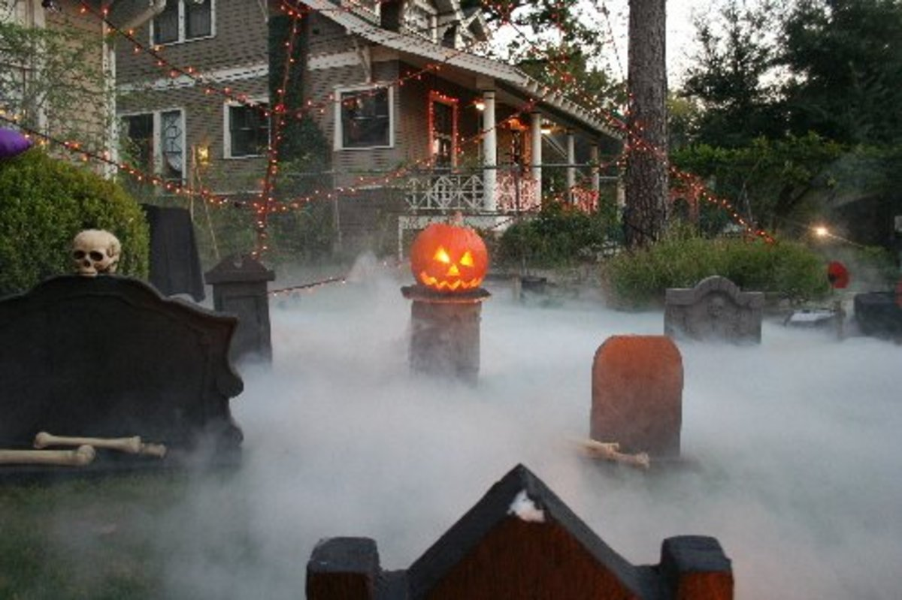
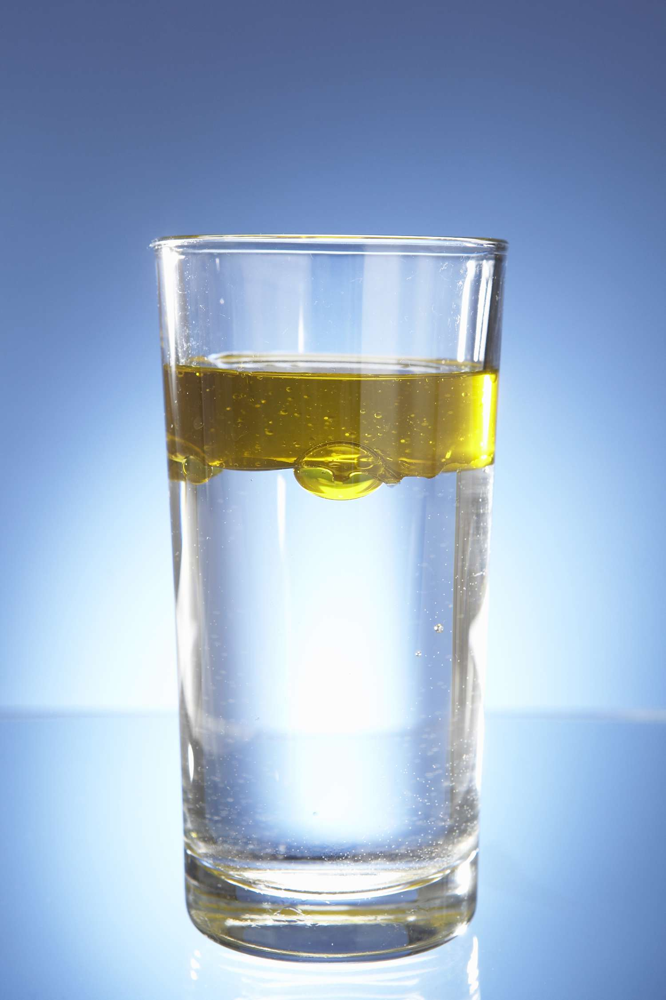
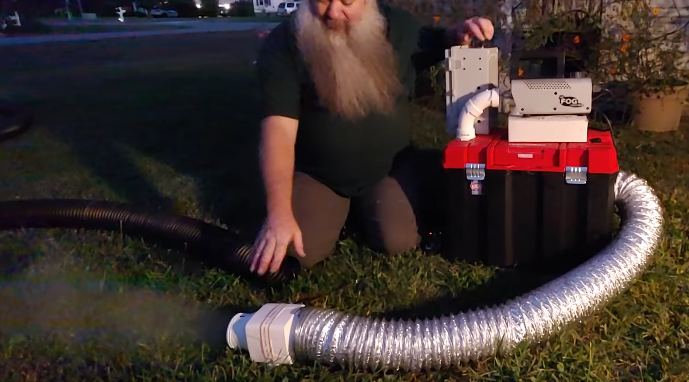
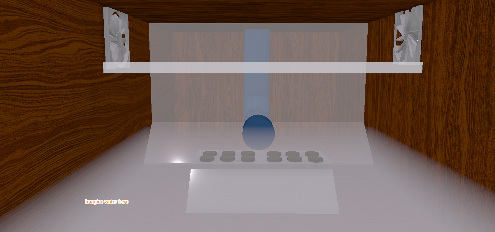
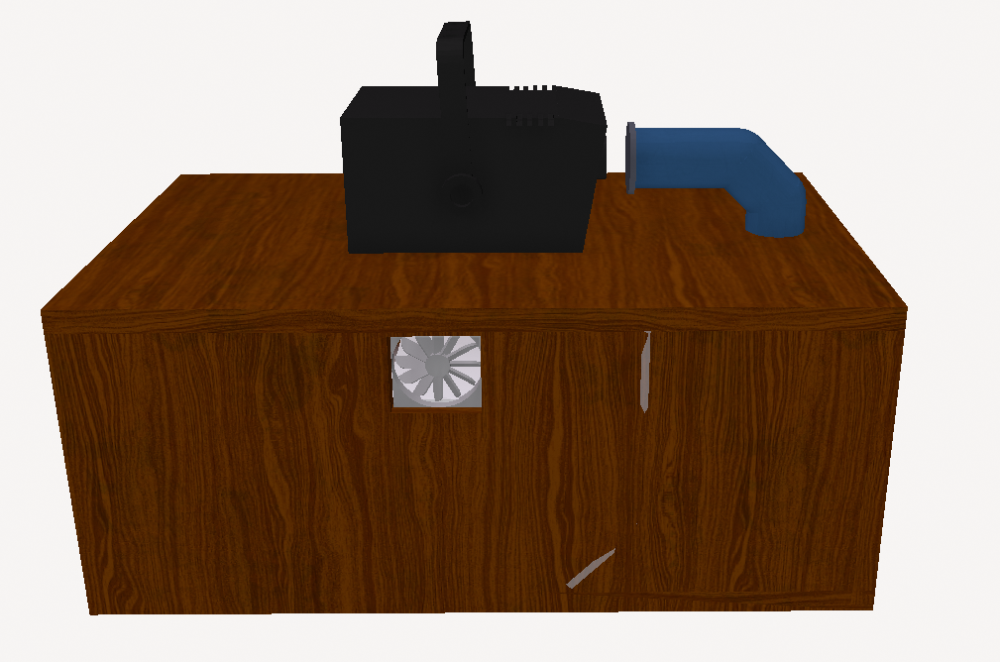
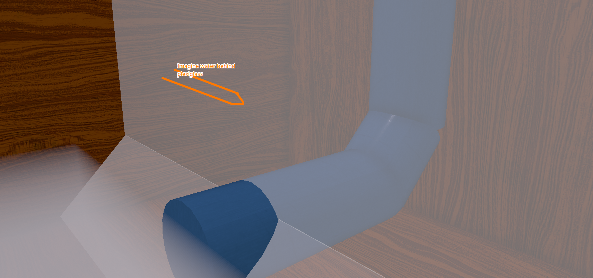

## 25/5/2025
### Introduction
We've probably all seen these haunted houses and lawn displays, with halloween props and jumping spiders, but have you noticed some of the more advanced ones have fog like it's coming out of the ground? That's low lying fog, and traditionally it's done with strapping a A/C unit to a regular fog machine and perhaps using some special fog liquid. But these can cost hundreds, maybe thosuands, of dollars, and A/C units are loud & heavy, eww I don't want that!

    

What if there was a way to get a very similar effect, but on the cheap? We all learnt in physics class that higher density gasses/liquids like to stay low, and lower density object like to be at the top. It's like when you mix water & oil, the water stays at the bottom, and the oil floats to the top. Water has a higher density than oil; and this is the same for gases.

    

Taking this logic, we need the fog to be "heavier" (a higher density) than the surronding air. We can do this into two ways, 

1. **Increasing the fog's mass**
    * Using denser fog fluids
    * Adding moisture to the fog to make it heavier
  
2. **Changing the temperature of the fog**
    * Adding a A/C unit
    * Using something already cold like Ice or dry ice
    * Evaporating water from the fog
  
This leaves a few options, I'm going to eliminate adding a A/C unit, and eliminate using something cold like Ice or Dry ice, since they're consumables. Great! Now I have a list!

We have the thinking part done, now we need to actually apply it and figure out the specifics. Fortunately, there are many videos on this on Youtube, with most of them using a Ultrasonic Mister / Atomizer / Nebulizer in order to accomplish both cooling and to increase the humidity of the fog. I feel there are ways to improve upon this design though.

Most designs have a fog machine on top of a large plastic box, with a angled piece of PVC piping extending from the box to the nozzle of the fog machine, spaced about a few centimeters away to allow for bernoulli's principle to take effect. The box is filled with water with the ultrasonic mister sitting near the water's surface to generate water vapor, the pressure forces the fog & water droplets to mix and eventually exit through an opening on the side.

    

## 26/5/2025
### Practical Design - 3D Model
I am terrible with CAD software and I hate TinkerCad, so I made a model in what I know best, Roblox Studio. I created a rough deisgn as a 3D model showing a bit what it would look like.

Check out the 3D Model [here at Poly.cam](https://poly.cam/capture/a39aacad-adc6-4940-a345-fb86110a87cd). Unfortunately the water didn't render correctly when exporting from roblox - so just imagine there's water at the bottom and at the far back where theres the piping.

    
    

    

